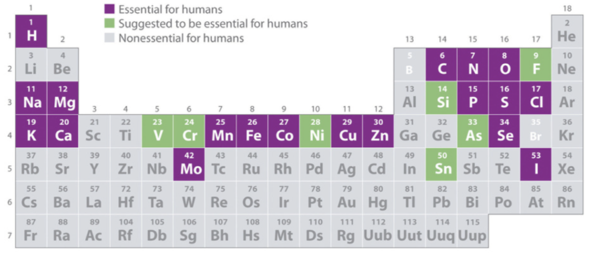

# **What are elements?**

- Over 118
- 90 occur naturally
- Made of 1 type of atom
    - Carbon
    - Oxygen
    - Etc.
- Can not be brocken down
- 25 are essential for life
    - 4 most common
        - Carbon
        - Hydrogen
        - Nitrogen
        - Oxygen

*__Figure A: Elements That Are Needed To Live__*
